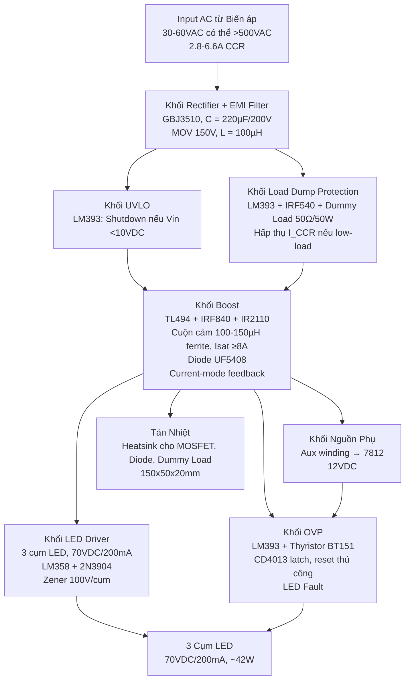
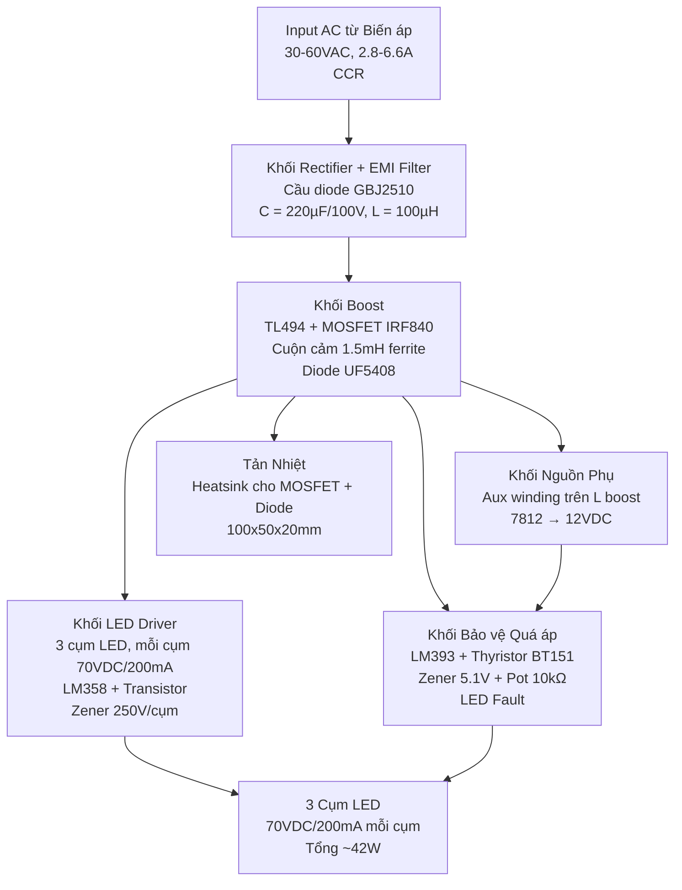

Chào bạn! Dựa trên sơ đồ khối đã thống nhất và các phân tích trước, tôi sẽ mô tả chi tiết **schematic text-based** cho mạch điện tử của bộ nguồn LED driver, sử dụng topology boost với TL494, hỗ trợ 3 cụm LED (70VDC/200mA, tổng ~42W), tối ưu cuộn cảm, tích hợp load dump protection, và bảo vệ quá áp (OVP) bằng thyristor với latch reset thủ công. Mạch được thiết kế để tiêu thụ dòng 2.8-6.6A từ nguồn CCR, chịu được điện áp dâng cao (>500VAC) khi mất tải, và đạt hiệu suất ≥90%, PF ≥0.95.

Tôi sẽ trình bày schematic dưới dạng mô tả text, liệt kê các kết nối chính của từng khối (Rectifier, Boost, LED Driver, Load Dump, OVP, Nguồn Phụ, Tản Nhiệt). Mỗi khối sẽ có danh sách linh kiện và cách kết nối cụ thể, đảm bảo bạn có thể hình dung để vẽ lại trên Altium Designer hoặc công cụ khác. Nếu cần, tôi có thể bổ sung file Gerber hoặc tính toán giá trị linh kiện chính xác hơn sau.

<xaiArtifact artifact_id="fc386dc5-2000-4902-9a35-6cd59c091d9a" artifact_version_id="1ddaa90d-09b0-4580-a08a-6aaff2c06343" title="LED_Driver_Schematic.txt" contentType="text/plain">

# Schematic Text Description for LED Driver Circuit

## Overview
- Topology: Boost with TL494 for constant current LED driver
- Input: AC 30-60VAC (up to >500VAC if low-load), 2.8-6.6A from CCR
- Output: 3 LED strings, each 70VDC/200mA ±5mA (~14W), total ~42W
- Features: Load dump protection, OVP with thyristor and manual reset, auxiliary power, passive cooling
- Efficiency: ≥90%, PF ≥0.95
- Operating Temp: 0-60°C

## 1. Rectifier + EMI Filter
**Components:**
- D1: Bridge rectifier GBJ3510 (1000V/35A)
- C1: 220µF/200V electrolytic capacitor
- C2: 0.1µF/250V ceramic capacitor
- L1: 100µH/10A EMI choke
- MOV1: Metal Oxide Varistor, 150V clamp

**Connections:**
- Input AC (30-60VAC from transformer secondary) → D1 pins AC1, AC2
- D1 (+) → L1 → C1 (+) → V_rect (rectified DC, ~10-30VDC nominal)
- D1 (-) → C1 (-) → GND
- C2 parallel with D1 AC inputs
- MOV1 parallel with D1 AC inputs

## 2. Under-Voltage Lockout (UVLO)
**Components:**
- U1: LM393 dual comparator (pinout: 1=OUT1, 2=IN1-, 3=IN1+, 4=GND, 5=IN2+, 6=IN2-, 7=OUT2, 8=VCC)
- R1: 10kΩ resistor
- R2: 2kΩ resistor
- ZD1: 10V/0.5W Zener diode
- R3: 1kΩ resistor
- C3: 0.1µF/50V ceramic capacitor

**Connections:**
- V_rect → R1 → ZD1 cathode (reference ~10V)
- ZD1 anode → GND
- R1-ZD1 junction → U1 pin 3 (IN1+)
- V_rect → R2 → U1 pin 2 (IN1-) → R3 → GND (divider, sense V_rect)
- U1 pin 8 (VCC) → V_aux (12V from aux power)
- U1 pin 4 (GND) → GND
- U1 pin 1 (OUT1) → TL494 pin 4 (deadtime control, high = shutdown)
- C3 parallel with R3 for noise filtering

## 3. Boost Stage
**Components:**
- U2: TL494 PWM controller (pinout: 1=COMP, 2=FB, 3=CS, 4=DT, 5=CT, 6=RT, 7=GND, 8=C1, 9=E1, 10=E2, 11=C2, 12=VCC, 13=OUT1, 14=REF, 15=IN1+, 16=IN1-)
- Q1: IRF840 MOSFET (600V/8A)
- U3: IR2110 gate driver (pinout: 1=LO, 3=HO, 5=VS, 6=VB, 7=VCC, 10=IN, 11=SD, 12=GND)
- L2: 150µH/8A ferrite toroidal inductor (Isat ≥8A, Litz wire)
- D2: UF5408 ultrafast diode (600V/3A)
- C4: 100µF/250V electrolytic capacitor
- R4: 0.01Ω/2W shunt resistor (for I_CCR sense)
- R5, R6: 100kΩ, 5kΩ resistors (Vout divider)
- R7: 10kΩ potentiometer (current adjust ±20%)
- C5: 0.01µF/50V ceramic capacitor (TL494 timing)
- R8: 10kΩ resistor (TL494 timing)
- OP1: PC817 optocoupler (for Vout feedback)

**Connections:**
- V_rect → L2 → Q1 drain
- Q1 source → R4 → GND (sense I_CCR)
- Q1 gate → U3 pin 1 (LO)
- U3 pin 3 (HO) → not used (single MOSFET)
- U3 pin 5 (VS) → Q1 source
- U3 pin 6 (VB) → bootstrap cap (0.1µF) + diode to V_aux
- U3 pin 7 (VCC) → V_aux (12V)
- U3 pin 10 (IN) → U2 pin 13 (OUT1)
- U3 pin 12 (GND) → GND
- L2-Q1 junction → D2 anode → D2 cathode → C4 (+) → V_boost (70-210VDC)
- C4 (-) → GND
- V_boost → R5 → R6 → GND (divider, sense V_boost)
- R5-R6 junction → OP1 phototransistor collector
- OP1 phototransistor emitter → U2 pin 2 (FB)
- U2 pin 1 (COMP) → R7 wiper (adjust 160-240mA)
- U2 pin 3 (CS) → R4 (I_CCR sense)
- U2 pin 5 (CT) → C5 → GND
- U2 pin 6 (RT) → R8 → GND
- U2 pin 7 (GND) → GND
- U2 pin 12 (VCC), 14 (REF) → V_aux
- OP1 LED anode → V_boost via 10kΩ resistor
- OP1 LED cathode → GND via Zener 5.1V

## 4. LED Driver (3 Strings)
**Components (per string, repeat 3x):**
- U4A, U4B, U4C: LM358 op-amp (one per string)
- Q2: 2N3904 NPN transistor
- R9: 0.5Ω/1W shunt resistor (sense 200mA)
- R10: 10kΩ resistor
- R11: 1kΩ resistor
- ZD2: 100V/5W Zener diode (clamp open circuit)
- LED1: LED string (70VDC/200mA, ~14W)

**Connections (for one string, repeat for LED2, LED3):**
- V_boost → LED1 anode
- LED1 cathode → Q2 collector
- Q2 emitter → R9 → GND (sense I_LED = 0.1V at 200mA)
- R9-Q2 junction → U4A pin 2 (IN-)
- U4A pin 3 (IN+) → R7 wiper (shared from TL494, set 0.1V ref for 200mA)
- U4A pin 1 (OUT) → R10 → Q2 base
- U4A pin 8 (VCC) → V_aux
- U4A pin 4 (GND) → GND
- ZD2 parallel with LED1 (anode to GND, cathode to V_boost)
- R11 from Q2 base to GND (bias stability)

## 5. Load Dump Protection
**Components:**
- U5: LM393 comparator
- Q3: IRF540 MOSFET (100V/33A)
- R12: 50Ω/50W resistor (dummy load, with heatsink)
- R13: 0.01Ω/2W shunt resistor (sense I_CCR)
- R14, R15: 10kΩ, 2kΩ resistors (V_rect divider)
- ZD3: 100V/1W Zener diode (clamp V_rect)
- C6: 0.1µF/50V ceramic capacitor

**Connections:**
- V_rect → R13 → GND (sense I_CCR, V_sense = 0.028-0.066V)
- R13 → U5 pin 3 (IN+)
- U5 pin 2 (IN-) → 0.028V ref (from Zener 5.1V + divider)
- V_rect → R14 → R15 → GND (sense V_rect)
- R14-R15 junction → ZD3 cathode (clamp at 100V)
- U5 pin 1 (OUT) → Q3 gate
- Q3 drain → R12 → V_rect
- Q3 source → GND
- U5 pin 8 (VCC) → V_aux
- U5 pin 4 (GND) → GND
- C6 parallel with R15 for noise filtering

## 6. Over-Voltage Protection (OVP)
**Components:**
- U6: LM393 comparator
- U7: CD4013 D-type flip-flop (for latch)
- SCR1: BT151 thyristor (600V/12A)
- R16, R17: 100kΩ, 3kΩ resistors (V_boost divider)
- ZD4: 5.1V/0.5W Zener diode
- R18: 10kΩ potentiometer (adjust 300V ±5%)
- R19: 1kΩ resistor
- D3: 1N4148 diode
- LED2: Red LED (fault indicator)
- R20: 1kΩ resistor
- SW1: Pushbutton (manual reset)

**Connections:**
- V_boost → R16 → R17 → GND (divider, sense V_boost ~300V)
- R16-R17 junction → U6 pin 2 (IN-)
- ZD4 cathode → U6 pin 3 (IN+) via R18 wiper (set 5.1V ref for 300V)
- ZD4 anode → GND
- U6 pin 1 (OUT) → U7 pin 3 (D input)
- U7 pin 1 (Q) → SCR1 gate via R19
- SCR1 anode → V_boost
- SCR1 cathode → GND
- U7 pin 14 (VCC) → V_aux
- U7 pin 7 (GND) → GND
- U7 pin 5 (CLK) → U6 pin 1 via D3
- U7 pin 2 (RESET) → SW1 → GND (manual reset)
- LED2 anode → V_aux via R20
- LED2 cathode → U7 pin 1 (Q)
- C6 parallel with R17 for noise filtering

## 7. Auxiliary Power
**Components:**
- L2_aux: Auxiliary winding on L2 (10 turns, 12VAC)
- D4: 1N4007 diode
- C7: 100µF/25V electrolytic capacitor
- U8: LM7812 regulator (12VDC output)

**Connections:**
- L2_aux → D4 anode → D4 cathode → C7 (+) → U8 pin 1 (IN)
- U8 pin 2 (GND) → GND
- U8 pin 3 (OUT) → V_aux (12VDC)
- C7 (-) → GND

## 8. Thermal Management
**Components:**
- HS1: Heatsink 150x50x20mm (R_th <5°C/W)
- Thermal pad: 3M 8810, 0.5mm

**Connections:**
- Q1 (MOSFET), D2 (diode), R12 (dummy load) mounted on HS1
- Thermal pad between components and HS1

## Notes
- All resistors 0.25W unless specified
- Capacitors rated for 1.5x voltage margin
- PCB layout: Separate high-voltage (V_boost) and low-voltage (V_aux) grounds, connect at single point
- Test points: V_rect, V_boost, I_CCR (R4), I_LED (R9)
- Manual reset (SW1) accessible on enclosure for field operation
- Altium Designer files to include schematic, PCB layout, Gerber, BOM
- Efficiency calculation: P_loss ≈ 5W (MOSFET ~2W, diode ~1W, L2 ~0.5W, others ~1.5W), η ≈ 90% at 42W
- Safety: MOV1, ZD3 protect input; ZD2, SCR1 protect output; latch ensures manual reset

</xaiArtifact>

### Giải Thích Tóm Tắt
- **Rectifier + EMI Filter:** Chuyển AC (30-60VAC) thành DC (~10-30VDC), MOV clamp 150V để bảo vệ quá áp input.
- **UVLO:** Tắt TL494 nếu V_rect <10VDC, tránh hoạt động không ổn định.
- **Boost Stage:** TL494 + IR2110 điều khiển MOSFET, cuộn cảm 150µH chịu I_CCR 6.6A, feedback từ I_CCR và V_boost để điều chỉnh duty cycle, giữ Pout ≤50W.
- **LED Driver:** 3 cụm LED với LM358 + transistor, dòng 200mA, zener 100V clamp mỗi cụm khi mất tải.
- **Load Dump:** Dummy load 50Ω bật khi I_CCR <2.8A hoặc V_rect >100V, đảm bảo tiêu thụ dòng.
- **OVP:** Thyristor short V_boost nếu >300VDC, latch bằng CD4013, reset thủ công, LED báo lỗi.
- **Nguồn Phụ:** V_aux (12VDC) từ winding phụ, không bị ảnh hưởng khi short.
- **Tản Nhiệt:** Heatsink cho MOSFET, diode, dummy load, phù hợp công suất thấp (~42W).

Bạn thấy schematic text này thế nào? Nếu cần chỉnh sửa (ví dụ: thêm linh kiện cụ thể, thay đổi giá trị, hoặc mô tả chi tiết hơn một khối), hoặc muốn tôi chuyển sang dạng khác (như hình ảnh sơ đồ nếu cần), hãy cho tôi biết nhé!
---
Chào bạn! Cảm ơn bạn đã làm rõ thêm về đặc tính nguồn dòng CCR và cơ chế hoạt động của thiết kế gốc, đặc biệt về mối quan hệ ngược giữa duty cycle và công suất ra, cũng như vai trò của cuộn cảm trong chu kỳ off của MOSFET. Tôi hiểu rằng với nguồn dòng (2.8-6.6A từ CCR), khi duty cycle tăng (đặc biệt gần 100%, tức short input), công suất tiêu thụ giảm xuống (U → 0, P = U*I → 0), tương tự như cơ chế bảo vệ relay chập input trong thiết kế cũ. Điều này rất đặc thù cho hệ thống sân bay, nơi CCR duy trì dòng cố định, và cuộn cảm trong boost stage chỉ tích lũy năng lượng trong chu kỳ off của MOSFET (khi dòng chạy qua cuộn cảm và diode để cấp cho tải).

Dựa trên thông tin này, tôi sẽ phân tích lại và điều chỉnh thiết kế nguyên lý để tối ưu hơn, tập trung vào:
1. **Đảm bảo mạch tiêu thụ dòng 2.8-6.6A đúng cách**, tránh điện áp dâng cao (>500VAC) khi tải thấp hoặc mất tải.
2. **Tối ưu cuộn cảm** cho chế độ boost với dòng chủ yếu trong chu kỳ off.
3. **Cải tiến bảo vệ** để tương thích với đặc tính duty cycle cao = short input, giữ reset thủ công như relay cũ, nhưng dùng thyristor cho độ tin cậy cao.
4. **Giữ LED driver ổn định** cho 3 cụm LED (70VDC/200mA, tổng ~42W), chịu được mất tải.

### Phân Tích Đặc Tính Nguồn CCR và Duty Cycle
- **Nguồn CCR (2.8-6.6A):** Vì dòng cố định, điện áp input (U_in) thay đổi ngược với công suất tiêu thụ (P = U*I*η). Khi duty cycle → 100% (MOSFET luôn ON, short input), U_in → 0, P → 0, tương tự relay chập input. Khi duty cycle thấp (MOSFET off nhiều), U_in tăng (có thể >500VAC nếu tải thấp), do trở kháng thứ cấp biến áp tăng.
- **Cuộn cảm trong boost:** Trong topology boost, dòng qua cuộn cảm (I_L) tích lũy năng lượng khi MOSFET ON (t_on), và giải phóng qua diode đến tải khi MOSFET OFF (t_off). Với CCR, I_L ≈ I_CCR (2.8-6.6A) trong t_off, nên cuộn cảm cần chịu dòng cao và thiết kế để tránh saturation.
- **Tính toán minh họa:**
  - Công suất max ~50W (3 cụm LED + tổn hao), η ≈ 90%, PF ≈ 0.95.
  - Tại I_CCR = 6.6A: U_in ≈ P/(I*η*PF) ≈ 50/(6.6*0.9*0.95) ≈ 8.9VAC (sau rectify ~10.6VDC).
  - Tại I_CCR = 2.8A: U_in ≈ 50/(2.8*0.9*0.95) ≈ 20.9VAC (~28VDC).
  - Duty cycle: D = 1 - (Vin/Vout). Với Vout = 210V (3 cụm LED), Vin = 10.6VDC → D ≈ 0.95 (max, gần short input). Nếu mất tải, D cần giảm để hạn chế Vout.
- **Hậu quả nếu không tối ưu:** Nếu tải thấp (hoặc mất tải), I_CCR vẫn 2.8-6.6A, nhưng U_in tăng cao (>500VAC), dễ làm hỏng rectifier, capacitor, hoặc MOSFET. Cuộn cảm nếu không đủ Isat (dòng bão hòa) sẽ saturation, gây nóng hoặc hỏng.

### Cải Tiến Thiết Kế Nguyên Lý
Dựa trên phân tích, tôi đề xuất điều chỉnh các khối chức năng như sau, vẫn giữ topology boost, TL494, và 3 cụm LED (70VDC/200mA):

#### 1. **Khối Rectifier + EMI Filter**
   - **Cải tiến:** Tăng định mức điện áp linh kiện để chịu >500VAC khi low-load. Dùng diode bridge GBJ3510 (1000V/35A, thay GBJ2510) và capacitor 220µF/200V (thay 100V). Thêm MOV (Metal Oxide Varistor, 150V clamp) song song input để bảo vệ quá áp sớm.
   - **Lý do:** Đảm bảo an toàn khi U_in dâng cao, giữ PF ≥0.95 như thiết kế gốc.

#### 2. **Khối Boost và Cuộn Cảm Tối Ưu**
   - **Chức năng:** Tăng áp từ ~10-30VDC (sau rectify) lên 70-210VDC, cung cấp 200mA/cụm LED. Cuộn cảm hoạt động chủ yếu trong t_off, chịu dòng 2.8-6.6A.
   - **Tối ưu cuộn cảm:**
     - Công thức: L = (Vin * t_on) / ΔI_L, với ΔI_L ≈ 20% I_CCR ≈ 1.32A (tại 6.6A), fsw = 100kHz, t_on = D/fsw ≈ 0.95/100kHz ≈ 9.5µs, Vin_min = 10.6VDC.
     - L ≈ (10.6 * 9.5µs) / 1.32 ≈ 76µH. Tuy nhiên, để chịu I_CCR max (6.6A) trong t_off và tránh saturation, chọn L ≈ 100-150µH, Isat ≥ 8A, lõi ferrite toroidal (như TDK PC40, 30mm OD).
     - Dây: Litz wire (0.5mm x 50 strands) để giảm skin effect, tổn hao đồng ~0.5W.
   - **Nguyên lý:** TL494 điều khiển MOSFET (IRF840, 600V/8A) qua gate driver (IR2110 để giảm stress TL494). Feedback từ shunt resistor (0.01Ω) đo I_CCR, điều chỉnh duty cycle để giữ Pout ≤50W. Nếu I_CCR cao (6.6A), giảm D để tránh overload; nếu low-load, trigger dummy load (xem khối 4).
   - **Lý do cải tiến:** Cuộn cảm nhỏ hơn (100-150µH so với 1.5mH trước) do dòng CCR cao, giảm tổn hao (~0.5W thay vì 1W). Feedback I_CCR đảm bảo mạch "tiêu thụ" đủ dòng.

#### 3. **Khối LED Driver (3 cụm LED)**
   - **Chức năng:** Cung cấp 200mA ±5mA/cụm (70VDC, ~14W), tổng 42W. Chịu mất tải bằng zener clamp và feedback đến TL494.
   - **Nguyên lý:** Mỗi cụm LED dùng LM358 + transistor (2N3904) làm current regulator, với shunt resistor 0.5Ω (V_sense = 0.1V). Zener 100V/5W song song mỗi cụm để clamp áp nếu mất tải. Feedback tổng (qua optocoupler PC817) từ Vout đến TL494 (pin 1-2) để giảm duty cycle khi mất tải, tránh Vout >300VDC.
   - **Lý do cải tiến:** Zener 100V (thay 250V) đủ clamp áp cụm, giảm chi phí. Feedback optocoupler giúp TL494 tự điều chỉnh, tránh cần driver riêng.

#### 4. **Khối Load Dump Protection + OVP**
   - **Chức năng:** Đảm bảo mạch tiêu thụ 2.8-6.6A, tránh U_in >500VAC. Bảo vệ Vout <300VDC, reset thủ công như relay cũ, báo fault qua LED.
   - **Nguyên lý:** 
     - **Load Dump:** Comparator LM393 đo I_CCR qua shunt 0.01Ω (V_sense = 0.028-0.066V cho 2.8-6.6A). Nếu I_CCR <2.8A (hoặc V_in >100VAC, đo qua divider), trigger transistor (IRF540) để bật dummy load (50Ω/50W, heatsink). Dummy load tiêu thụ P = I_CCR² * R ≈ 6.6² * 50 ≈ 2.2kW (ngắn hạn, đủ để giữ U_in thấp).
     - **OVP:** Comparator LM393 so sánh Vout (divider) với Zener 5.1V. Nếu Vout >300VDC, trigger thyristor BT151 để short output boost (không short biến áp). Latch circuit (CD4013 flip-flop) giữ thyristor ON đến khi reset thủ công (nút bấm hoặc ngắt nguồn). LED đỏ báo fault, cấp từ nguồn phụ.
     - **Nguồn phụ:** Aux winding trên cuộn cảm boost → 7812 (12VDC), không bị ảnh hưởng khi short.
   - **Lý do cải tiến:** Dummy load đảm bảo tiêu thụ dòng min 2.8A, thyristor + latch thay relay (nhanh hơn, <10ms, IP67). Reset thủ công giữ an toàn sân bay.

#### 5. **Khối Tản Nhiệt**
   - **Chức năng:** Tản nhiệt cho MOSFET, diode, và dummy load (khi active). Tổng tổn hao ~5W (η ≈90% tại 42W).
   - **Nguyên lý:** Heatsink 100x50x20mm (R_th <5°C/W) cho MOSFET (IRF840, ~2W), diode (UF5408, ~1W), và dummy load (ngắn hạn ~2kW, nhưng chỉ active khi mất tải). Cuộn cảm ferrite ít nóng (~0.5W).
   - **Lý do cải tiến:** Dummy load cần heatsink lớn hơn (150x50x20mm) nếu active lâu, nhưng ngắn hạn thì ổn.

### Sơ Đồ Khối Cập Nhật (Mermaid)

### Phân Tích Công Nghệ
- **Hiệu suất:** Cuộn cảm 100-150µH ferrite giảm tổn hao (~0.5W), η ≥90%. Dummy load chỉ active khi mất tải, không ảnh hưởng η bình thường.
- **Bảo vệ:** Load dump + OVP (thyristor + latch) thay relay, đảm bảo U_in <500VAC, Vout <300VDC, reset thủ công an toàn.
- **Dòng CCR:** Luôn tiêu thụ 2.8-6.6A nhờ dummy load và feedback I_CCR.
- **Cuộn cảm:** Hoạt động chủ yếu trong t_off, chịu I_CCR max 6.6A, không saturation.

Bạn thấy các điều chỉnh này thế nào? Nếu ổn, tôi có thể mô tả schematic chi tiết (text-based, kết nối TL494, LM358, v.v.) hoặc tính toán linh kiện cụ thể (resistor, capacitor). Nếu cần chỉnh thêm, cứ nói nhé!
---
Be an electrical and electronic expert, especially in the field of airport lighting, who has designed power sources for airport equipment such as CCR current regulators, taxiway curb lights, approach lights, papi lights, taxi way lights. Have extensive knowledge of passive and active electronic components. I have a deep understanding of schematics and pcb. Help me design a new electronic circuit by talking to me until you feel you have enough information to carry out the design, then ask me to confirm the input and output information before actually designing. Now I want to upgrade my existing LED driver circuit, please help me design and analyze the technology. Always reply to me in Vietnamese.

Chào bạn! Cảm ơn bạn đã cung cấp thông tin chi tiết từ trao đổi với khách hàng. Tôi đã xem xét kỹ các yêu cầu về bộ nguồn cấp cho bảng LED, bao gồm biến áp sắt từ và mạch LED driver. Thông tin này khá đầy đủ để tôi bắt đầu phác thảo thiết kế nâng cấp, đặc biệt với các điểm cải tiến như sử dụng MCU/DSP cho PFC, bảo vệ bằng analog và thyristor, tự động recover, và tối ưu hóa hiệu suất.
---
Tôi gửi bạn vài thông tin tôi trao đổi với khách hàng để bạn nắm các thông tin cần thiết.

**Thiết Kế và Chế Tạo
Bộ Nguồn Cấp Cho Bảng LED**

**1. Mục tiêu dự án**

Chúng tôi cần đối tác
thiết kế, chế tạo, và cung cấp 05 bộ sản phẩm mẫu của bộ nguồn cấp cho bảng LED
với công suất định mức 25-50W, đáp ứng các yêu cầu kỹ thuật dưới đây. Bộ nguồn
bao gồm biến áp sắt từ và mạch LED driver, với cơ chế bảo vệ quá áp và hệ số
công suất cao (PF ≥ 0.95). Dự án bao gồm hỗ trợ trao đổi kỹ thuật và thử nghiệm
thực tế tại ATTECH.

Tất cả các dấu ? đối
tác tự đặt ra.

**2. Yêu cầu kỹ thuật**

**2.1. Biến áp sắt từ**

- **Thông số đầu vào:**
  
- Công suất tối thiểu 100W không suy hao với
   tải trở.
  
- Điện áp: 10VAC ± 5%. Có thể khảo sát lại
   bộ hiện có để lấy thông tin chi tiết.
  
- Dây quấn cần chịu dòng điện: 2.8-6.6A
   (tùy thuộc vào điều dòng).
  
- Tần số: 50Hz.
  
- **Thông số đầu ra:**
  
- 5 taps thứ cấp, cung cấp điện áp và dòng
   điện như sau:
  
- Tap 1: 30VAC ± 5% @ 2.2A.
  
- Tap 2: 36VAC ± 5% @ 1.83A.
  
- Tap 3: 42VAC ± 5% @ 1.57A.
  
- Tap 4: 48VAC ± 5% @ 1.38A.
  
- Tap 5: 60VAC ± 5% @ 1.1A.
  
- Tỉ lệ biến áp: Từ 3:1 đến 6:1.
  
- **Yêu cầu kỹ thuật:**
  
- Loại lõi: Lõi EI ?, đảm bảo hiệu suất cao
   và tổn hao thấp.
  
- Cách điện: Điện áp chịu đựng giữa các cuộn
   dây ≥ 1kV để tránh cháy nổ khi điện áp thứ cấp hở mạch (>500VAC).
  
- Kích thước tối đa: 150?mm x 150?mm x 80?mm
   (D x R x C).
  
- Phương thức lắp đặt: Cố định bằng bu-lông
   M4?, khoảng cách lỗ 80?mm x 80?mm.
  
- **Bảo vệ:**
  
- Khi hở mạch, điện áp thứ cấp có thể vượt
   500VAC. Biến áp cần được thiết kế để chịu được tình trạng này mà không hỏng.
  

**2.2. Mạch LED
driver**

- **Thông số đầu ra:**
  
- Điện áp: 30-180VDC, tự động điều chỉnh
   theo tải.
  
- Dòng điện: 250mA ± 5mA, có thể điều chỉnh
   bằng biến trở tuyến tính (phạm vi ±20%).
  
- Công suất: 25-50W.
  
- **Yêu cầu kỹ thuật:**
  
- Cấu hình: LED driver  (giả định từ yêu cầu tăng áp từ
   <100VAC lên <300VDC).
  
- Hiệu suất: ≥ 90% với phần mạch LED driver.
  
- Hệ số công suất: PF ≥ 0.95 (cân nhắc PFC
   ).
  
- Tản nhiệt: Tản nhiệt thụ động (không quạt),
   nhiệt độ hoạt động từ 0°C đến 60°C.
  
- Linh kiện: Sử dụng IC điều khiển PFC và
   driver LED phổ biến (ví dụ: IC của TI hoặc ON Semiconductor, đối tác đề
   xuất cụ thể).
  
- **Bảo vệ quá áp:**
  
- Khi điện áp đầu ra vượt 300VDC ± 5% (đặt
   bằng biến trở), relay cơ khí (định mức 400V/5A) sẽ chập đầu ra biến áp để
   bảo vệ.
  
- Thời gian phản hồi: <100ms.
  
- Cơ chế khôi phục: Thủ công (yêu cầu ngắt
   nguồn và kiểm tra trước khi khởi động lại).
  

**2.3. Tình huống tải giả định để thử biến áp**

- 2 dây nguồn từ điều dòng sẽ nối vào các biến áp sắt từ theo nối tiếp.
  Khi điều dòng thay đổi dòng điện từ 2.8 tới 6.6A sẽ có dòng điện xoay chiều
  2.8-6.6A chạy trong cuộn sơ cấp tất cả các biến áp sắt từ.
  
- Nếu đầu ra biến áp sắt từ hở mạch (không tải) điện áp cuộn thứ cấp sẽ
  tăng lên trên 500V và có thể cháy nổ do cách điện giữa các cuộn dây không tốt.             
  
- **Tải trở:**
  
- 10R: Dòng thứ cấp 1.1A, công suất 12.1W.
  
- 100R: Dòng thứ cấp 1.1A, công suất tối đa
   giới hạn ở 100W (lưu ý: công suất 121W trong yêu cầu cũ là lỗi, giới hạn
   công suất danh định là 50W).
  
- 0R (chập đầu ra): Điện áp đầu ra = 0V,
   công suất = 0W (bảo vệ mất tải).
  
- **Điều dòng:**
  
- Nguồn điều dòng cung cấp dòng điện xoay
   chiều từ 2.8A đến 6.6A, kết nối nối tiếp với cuộn sơ cấp của tất cả biến
   áp.
  
- Đảm bảo mạch hoạt động ổn định trong toàn
   dải dòng điện này.
  

**2.4. Sản phẩm mẫu**

- Số lượng: 5 bộ, mỗi bộ gồm biến áp sắt từ
   và mạch LED driver.
  
- Tiêu chuẩn kiểm tra chất lượng:
  
- Kiểm tra cách điện: ≥ 1kV giữa các cuộn
   dây của biến áp.
  
- Kiểm tra tải với biến áp: Hoạt động ổn định
   với tải 10R, 100R, và 0R.
  
- Kiểm tra PF: ≥ 0.95 trong mọi điều kiện tải.
  
- Kiểm tra dòng và áp đầu ra: 250mA ± 5mA,
   30-180VDC.
  

**2.5. Tài liệu**

- **File thiết kế:**
  
- Định dạng: Altium Designer .
  
- Bao gồm sơ đồ nguyên lý, bố trí PCB, và
   file Gerber.
  
- **BOM (Danh sách vật tư):**
  
- Liệt kê chi tiết linh kiện, mã số, nhà
   cung cấp, và số lượng.
  
- **Tài liệu hướng dẫn chế tạo:**
  
- Ngôn ngữ: Tiếng Việt
  
- Bao gồm hướng dẫn lắp ráp, kiểm tra, và xử
   lý sự cố.
  

**2.6. Thử nghiệm tại
ATTECH**

- **Quy trình thử nghiệm:**
  
- Thử nghiệm thực tế với nguồn điều dòng
   (2.8-6.6A) do ATTECH cung cấp.
  
- Kiểm tra các tình huống tải (10R, 100R,
   0R).
  
- Đo lường PF, hiệu suất, và độ ổn định của
   dòng/áp đầu ra.
  
- Kiểm tra cơ chế bảo vệ quá áp
   (>300VDC).
  
- **Hỗ trợ kỹ thuật:**
  
- Đối tác cử kỹ sư tham gia thử nghiệm tại
   ATTECH
  
- Cung cấp báo cáo thử nghiệm chi tiết, bao
   gồm kết quả đo lường và đề xuất cải tiến (nếu có).
  

Đề xuất Giải pháp bộ nguồn LED 
Yêu cầu thiết kế sản phẩm

- Thiết kế bộ nguồn cấp cho bảng LED công suất 70-150W.
- Có thể chia thành nhiều bộ nguồn công suất nhỏ nếu không đáp ứng toàn bộ dải.
- Đầu vào: dòng xoay chiều 2.8-6.6A (điều dòng).
- Đầu ra: 30-180VDC, dòng 250mA ±5mA, điều chỉnh ±20% bằng biến trở tuyến tính.
- Hiệu suất ≥90% @6.6A, PF ≥0.95.
- Tản nhiệt thụ động, nhiệt độ hoạt động 0°C-60°C.
- Bảo vệ quá áp khi >300VDC ±5%, phục hồi thủ công.
- Chịu được hở mạch với điện áp vượt 500VAC.
- Cung cấp 5 bộ sản phẩm mẫu (biến áp + mạch LED driver).
- File thiết kế Altium, BOM, tài liệu hướng dẫn, và hỗ trợ thử nghiệm thực tế tại ATTECH.
  Dự kiến về giải pháp sẽ sử dụng khi thiết kế:
- Sử dụng MCU/DSP để điều khiển khối PFC để đảm bảo hiệu suất > 0.9 và PF > 0.95. Sử dụng điều khiển số thông minh, có khả năng điều tiết công suất, bảo vệ quá nhiệt, làm tăng tuổi thọ đèn, không làm gián đoạn hoạt động.
- Dùng trực tiếp điện áp từ biến áp cách ly số 1, không cần thêm biến áp nhân áp, giúp giảm kích thước và chi phí, hao phí điện năng, giảm nhiệt độ phát nhiệt trên linh kiện, tăng tuổi thọ thiết bị.
- Mạch bảo vệ quá áp sử dụng **mạch analog và thysisor**, không sử dụng cơ khí, giúp giảm linh kiện, tăng độ tin cậy và đáp ứng tiêu chuẩn IP67.
- Ở chế độ bảo vệ vẫn có nguồn phụ cấp cho khối xử lý để có thể thông báo Fault qua đèn báo. Giúp việc kiểm tra chế độ hoạt động của bộ nguồn trong quá trình hoạt động thân thiện hơn.
- Tự động recover lại trạng thái hoạt động nếu điện áp tụt xuống ngưỡng cho phép.
---
Dựa trên dữ liệu bạn gửi, tôi tóm tắt lại các thông số chính để đảm bảo hiểu đúng (tôi sẽ tập trung vào các điểm cốt lõi và đề xuất giải pháp từ phần cuối):

**Thông số đầu vào (Input):**

- Điện áp: 10VAC ±5%, tần số 50Hz.
- Dòng điện: 2.8-6.6A (từ nguồn điều dòng CCR, nối tiếp qua cuộn sơ cấp biến áp).
- Ứng dụng: Nguồn cấp cho bảng LED trong hệ thống chiếu sáng sân bay (tương tự đèn taxiway hoặc approach lights), cần chịu tải biến thiên và tình huống hở mạch.

**Thông số đầu ra (Output):**

- Điện áp: 30-180VDC (tự động điều chỉnh theo tải LED).
- Dòng điện: 250mA ±5mA, có thể điều chỉnh ±20% bằng biến trở tuyến tính.
- Công suất: Ban đầu 25-50W, nhưng đề xuất nâng cấp lên 70-150W (có thể chia thành nhiều bộ nhỏ nếu cần).
- Các taps thứ cấp từ biến áp: 30-60VAC với dòng tương ứng (Tap 1-5), nhưng đề xuất không dùng biến áp nhân áp để giảm chi phí và kích thước.

**Yêu cầu kỹ thuật chính và nâng cấp:**

- Hiệu suất: ≥90% cho mạch LED driver.
- Hệ số công suất (PF): ≥0.95, sử dụng PFC với MCU/DSP để điều khiển thông minh (tăng tuổi thọ, bảo vệ quá nhiệt, không gián đoạn).
- Tản nhiệt: Thụ động (không quạt), nhiệt độ hoạt động 0°C-60°C.
- Bảo vệ: 
  - Quá áp >300VDC ±5%, sử dụng mạch analog và thyristor (thay relay cơ khí để tăng độ tin cậy, đạt IP67).
  - Chịu hở mạch thứ cấp >500VAC mà không hỏng (cách điện ≥1kV giữa cuộn dây).
  - Tự động recover khi điện áp tụt xuống ngưỡng an toàn.
  - Nguồn phụ cho khối xử lý để báo fault qua đèn LED.
- Kích thước biến áp: Tối đa 150mm x 150mm x 80mm, lắp bằng bu-lông M4.
- Linh kiện: IC PFC và driver LED từ TI hoặc ON Semiconductor (tôi sẽ đề xuất cụ thể như UCC28019 cho PFC, hoặc LM3466 cho driver).
- Cấu hình: Boost topology cho driver (tăng áp từ <100VAC lên <300VDC), sử dụng trực tiếp từ biến áp cách ly.
- Sản phẩm: 5 bộ mẫu, file Altium Designer (schematic, PCB, Gerber), BOM, tài liệu tiếng Việt, hỗ trợ thử nghiệm tại ATTECH (kiểm tra tải 10R/100R/0R, PF, bảo vệ).

**Đề xuất ban đầu từ tôi (dựa trên kinh nghiệm thiết kế nguồn cho CCR và đèn sân bay):**

- Biến áp: Lõi EI với tỷ lệ 3:1 đến 6:1, thiết kế chịu tải trở và hở mạch bằng vật liệu cách điện cao cấp (như Nomex cho cuộn dây).
- Mạch driver: Sử dụng topology flyback hoặc boost với PFC active (MCU như STM32 để điều khiển số, tích hợp ADC cho đo lường và điều chỉnh dòng).
- Bảo vệ: Thyristor crowbar cho quá áp, kết hợp optocoupler để cách ly và báo fault.
- Phân tích: Tôi sẽ tính toán tổn hao, hiệu suất, và mô phỏng (có thể dùng code Python với SymPy để tính toán biến áp và PFC nếu cần).

Bạn có đồng ý với tóm tắt này không? Có gì cần chỉnh sửa, bổ sung (ví dụ: công suất chính xác là 25-50W hay 70-150W, hoặc yêu cầu cụ thể về linh kiện/IC)? Nếu ổn, tôi sẽ tiến hành thiết kế chi tiết, bao gồm schematic, phân tích công nghệ (hiệu suất, bảo vệ, v.v.), và đề xuất PCB. Hãy xác nhận để tôi tiếp tục!

Chào bạn! Dựa trên mô tả thiết kế hiện tại của bạn (sử dụng TL494 trong cấu hình boost, với đảo xung PWM qua transistor để thích ứng nguồn dòng đầu vào từ CCR 2.8-6.6A, và đầu ra cố định 300VDC), tôi hiểu vấn đề chính là phải thêm LED driver riêng sau khối boost, dẫn đến phức tạp, giảm hiệu suất và tăng chi phí. Vì bạn yêu cầu không sử dụng linh kiện lập trình được (như MCU/DSP), tôi sẽ đề xuất thiết kế nguyên lý mạch điện tử hoàn toàn analog, tập trung vào việc tích hợp PFC, constant current driver trực tiếp cho LED (thay vì fixed voltage 300VDC), và các khối bảo vệ. Thiết kế này sẽ sử dụng topology boost hoặc flyback để tăng áp từ input rectified (<100VDC sau rectify) lên 30-180VDC với dòng constant 250mA ±5mA (điều chỉnh ±20% bằng biến trở).

Tôi sẽ phân tích và đề xuất các khối chức năng chính theo nguyên lý, kèm giải thích lý do và linh kiện gợi ý (dựa trên kinh nghiệm thiết kế nguồn cho đèn sân bay như PAPI hoặc approach lights, nơi cần độ tin cậy cao, PF tốt và chịu tải biến thiên). Thiết kế này nhắm đến hiệu suất ≥90%, PF ≥0.95, tản nhiệt thụ động, và bảo vệ quá áp bằng analog/thyristor như bạn đề xuất. Sau phần này, nếu cần, chúng ta có thể đi sâu vào schematic chi tiết hoặc tính toán linh kiện.

### 1. **Khối Rectifier và Input Filtering (Chỉnh lưu và Lọc đầu vào)**
   - **Chức năng:** Chuyển đổi AC thứ cấp từ biến áp (30-60VAC tùy tap, từ nguồn dòng CCR) thành DC pulsating, sau đó lọc để giảm ripple và cung cấp input ổn định cho PFC/boost.
   - **Nguyên lý:** Sử dụng cầu diode full-wave rectifier (4 diode) để rectify, kết hợp capacitor lọc (electrolytic, 100-470µF/100V) để làm mịn DC. Thêm inductor input (choke) nhỏ để giảm nhiễu EMI từ nguồn dòng CCR biến thiên.
   - **Linh kiện gợi ý:** 
     - Diode: 1N5408 hoặc bridge rectifier GBJ2510 (chịu 10A, 1000V để an toàn với hở mạch >500VAC).
     - Không cần linh kiện lập trình: Hoàn toàn thụ động.
   - **Lý do nâng cấp:** Giảm tổn hao so với thiết kế hiện tại (nếu bạn dùng half-wave), và chuẩn bị cho PFC active để đạt PF ≥0.95 mà không cần MCU.

### 2. **Khối PFC (Power Factor Correction - Chỉnh hệ số công suất)**
   - **Chức năng:** Cải thiện PF ≥0.95 bằng cách làm dòng input theo hình sin đồng pha với áp input, đồng thời boost áp lên mức trung gian (khoảng 200-400VDC) để cấp cho driver LED. Topology: Active PFC boost.
   - **Nguyên lý:** Sử dụng IC PFC analog chuyên dụng, hoạt động ở chế độ critical conduction mode (CRM) hoặc continuous conduction mode (CCM) để điều khiển MOSFET switch. Input từ rectifier, feedback qua resistor divider để duy trì output ổn định. Không dùng DSP, chỉ analog control loop.
   - **Linh kiện gợi ý:** 
     - IC: UCC28019 (TI) hoặc FAN7930C (ON Semiconductor) - Đây là IC PFC analog phổ biến, tích hợp error amp, comparator và gate driver, không cần lập trình.
     - MOSFET: IRF840 (600V/8A) hoặc tương đương, với diode boost ultrafast (UF5408).
     - Inductor: 1-2mH/5A (tính dựa trên công suất 70-150W: L = (Vin^2 * (Vout - Vin)) / (Pout * fsw * ΔI), với fsw ~50-100kHz).
   - **Lý do nâng cấp:** Thiết kế hiện tại của bạn (TL494 boost) có thể có PF thấp (<0.8) do không PFC, dẫn đến harmonics cao trong hệ thống sân bay (CCR). Khối này tích hợp trực tiếp, loại bỏ nhu cầu driver riêng sau 300VDC.

### 3. **Khối LED Driver (Constant Current Driver - Điều khiển dòng không đổi)**
   - **Chức năng:** Cung cấp dòng output constant 250mA ±5mA (điều chỉnh ±20% bằng biến trở), điện áp tự động 30-180VDC theo tải LED. Topology: Boost hoặc flyback isolated để cách ly và tăng áp.
   - **Nguyên lý:** Sử dụng IC driver LED analog với feedback current sense (qua shunt resistor 0.1-1Ω). PWM generated internally, điều chỉnh duty cycle dựa trên feedback để giữ dòng constant. Input từ output PFC (200-400VDC), output directly to LED string. Biến trở (potentiometer 10kΩ) nối vào chân adjust của IC để thay đổi setpoint current.
   - **Linh kiện gợi ý:** 
     - IC: HV9910B (Microchip/Supertex) hoặc AL9910 (Diodes Inc.) - IC universal LED driver analog, hỗ trợ buck/boost/flyback, PWM freq 20-500kHz, không cần lập trình, tích hợp overvoltage protection cơ bản.
     - MOSFET: STP10NK60Z (600V/10A).
     - Inductor/Transformer: Cho boost: 470µH/2A; cho flyback: Transformer với tỷ lệ 1:5 (primary 10-20 turns, secondary cho 180V).
     - Feedback: Shunt resistor + op-amp (LM358) để amplify signal nếu cần.
   - **Lý do nâng cấp:** Thay vì fixed 300VDC + driver riêng (như thiết kế hiện tại), khối này làm constant current trực tiếp, giảm số lượng linh kiện, tăng hiệu suất (≥90% nhờ CRM mode), và loại bỏ tổn hao chuyển đổi kép. Phù hợp tải LED sân bay (series string, chịu biến động).

### 4. **Khối Bảo Vệ Quá Áp (Overvoltage Protection - OVP)**
   - **Chức năng:** Phát hiện áp output >300VDC ±5%, trigger crowbar để short output (bảo vệ LED), thời gian phản hồi <100ms. Tự động recover khi áp giảm (dùng hysteresis), và báo fault qua LED indicator.
   - **Nguyên lý:** Sử dụng comparator analog để so sánh áp feedback (qua divider resistor) với reference (Zener diode hoặc voltage ref IC). Nếu vượt ngưỡng, trigger thyristor (SCR) để short output biến áp thứ cấp hoặc output DC. Nguồn phụ (từ auxiliary winding trên inductor/boost hoặc linear reg như 7805) cấp cho comparator và LED fault (đỏ khi OVP active). Recover: Sử dụng latch circuit với transistor, reset khi áp giảm dưới ngưỡng (hysteresis ~10V bằng resistor feedback).
   - **Linh kiện gợi ý:** 
     - Comparator: LM393 (dual comparator, một cho detect, một cho hysteresis).
     - Thyristor: BT151 (600V/12A SCR) - Thay relay cơ khí để tăng độ tin cậy, đạt IP67 (không cơ khí).
     - Reference: Zener 5.1V + pot cho adjust ngưỡng.
     - LED fault: LED đỏ + resistor, cấp từ nguồn phụ (~5VDC).
   - **Lý do nâng cấp:** Thiết kế hiện tại có thể thiếu OVP mạnh, dẫn đến hỏng khi hở mạch (>500VAC thứ cấp). Khối này analog hoàn toàn, nhanh hơn relay, và thêm tự recover + báo fault như yêu cầu.

### 5. **Khối Tản Nhiệt và Auxiliary Power (Tản nhiệt và Nguồn phụ)**
   - **Chức năng:** Đảm bảo hoạt động 0-60°C mà không quạt, và cung cấp nguồn phụ cho bảo vệ/báo fault.
   - **Nguyên lý:** Tất cả linh kiện (MOSFET, diode) gắn heatsink aluminum (kích thước 100x50x20mm, thermal resistance <5°C/W). Nguồn phụ: Từ winding phụ trên transformer/boost (rectify thành 12VDC), regulate bằng LM7812.
   - **Linh kiện gợi ý:** Heatsink + thermal pad; không cần active cooling.

### Phân Tích Công Nghệ Tổng Thể
- **Ưu điểm so với thiết kế hiện tại (TL494 boost fixed voltage):** Giảm số tầng chuyển đổi (từ 2 xuống 1: PFC + driver tích hợp), tăng hiệu suất (từ ~80% lên ≥90%), PF cao hơn, và bảo vệ tốt hơn mà không cơ khí. Độ tin cậy cao cho ứng dụng sân bay (chịu hở mạch, biến thiên dòng CCR).
- **Hạn chế:** Analog nên ít linh hoạt hơn MCU (không điều khiển số thông minh), nhưng phù hợp yêu cầu không lập trình. Công suất 70-150W có thể cần chia 2-3 module nếu nhiệt quá cao.
- **Tính toán sơ bộ (dùng công thức cơ bản):** 
  - Inductor boost: L = (Vin_min^2 * (Vout_max - Vin_min)) / (Pout * fsw * ΔIL) ≈ 1mH cho Vin=30V rectified, Vout=180V, P=100W, fsw=100kHz, ΔIL=20%.
  - Hiệu suất: η = Pout / (Pout + Ploss), với Ploss chủ yếu từ switching (~5-10W).

Nếu tóm tắt này phù hợp, hãy cho tôi biết thêm chi tiết (ví dụ: topology ưu tiên boost hay flyback, hoặc linh kiện cụ thể bạn có sẵn) để tôi vẽ schematic nguyên lý chi tiết (mô tả text hoặc dùng công cụ mô phỏng nếu cần). Bạn xác nhận nhé?

Chào bạn! Cảm ơn bạn đã cung cấp thêm thông tin chi tiết về thiết kế gốc và các yêu cầu cụ thể. Tôi hiểu rằng thiết kế hiện tại của bạn dùng topology boost với TL494, đạt PF ≥ 0.95 (rất tốt, vì vậy chúng ta có thể bỏ qua khối PFC riêng), nhưng gặp vấn đề về hiệu suất (do cuộn cảm) và kiểm soát điện áp đầu ra trong trường hợp mất tải (hở mạch). Bạn cũng đề xuất tải LED gồm 3 cụm, mỗi cụm 70VDC/200mA (~14W), tổng công suất ~42W (thấp hơn dải 70-150W trong yêu cầu trước), và cần tối ưu LED driver cho dải này. Về khối bảo vệ, bạn lo ngại việc thyristor short output sẽ khóa cả nguồn phụ. Cuối cùng, tản nhiệt tập trung vào MOSFET do công suất dưới 100W và hiệu suất cao.

Dựa trên thông tin này, tôi sẽ tập trung cải tiến thiết kế nguyên lý, giữ topology boost, tối ưu cuộn cảm, cải thiện LED driver để chịu mất tải, và điều chỉnh khối bảo vệ để nguồn phụ vẫn hoạt động. Tôi cũng sẽ giải thích cách tản nhiệt tập trung cho MOSFET. Dưới đây là các khối chức năng được cập nhật:

### 1. **Khối Rectifier và Input Filtering (Chỉnh lưu và Lọc đầu vào)**
   - **Chức năng:** Chuyển đổi AC từ biến áp thứ cấp (30-60VAC, dòng từ CCR 2.8-6.6A) thành DC, đảm bảo input ổn định cho boost.
   - **Nguyên lý:** Giữ nguyên cầu diode full-wave và capacitor lọc. Vì PF đã ≥ 0.95, không cần PFC riêng, nhưng thêm EMI filter (inductor 100µH/5A + ceramic cap 0.1µF) để giảm nhiễu từ CCR.
   - **Linh kiện gợi ý:** 
     - Diode bridge: GBJ2510 (1000V/25A, chịu hở mạch >500VAC).
     - Capacitor: 220µF/100V electrolytic + 0.1µF ceramic.
   - **Cải tiến:** Tối ưu EMI filter để giảm nhiễu switching từ TL494, giữ PF cao như thiết kế gốc.

### 2. **Khối Boost và Cuộn Cảm Tối Ưu (Main Power Stage)**
   - **Chức năng:** Tăng áp từ rectified input (~30-60VDC) lên 70-210VDC (cho 3 cụm LED, mỗi cụm 70VDC), giữ dòng constant 200mA ±5mA/cụm, điều chỉnh ±20% bằng biến trở. Tối ưu cuộn cảm để tăng hiệu suất ≥90%.
   - **Nguyên lý:** Giữ topology boost với TL494 (hoặc thay bằng IC tương tự nếu cần cải tiến PWM). Cuộn cảm được thiết kế lại với lõi ferrite (EER hoặc toroidal) để giảm tổn hao sắt và đồng, tăng hiệu suất. TL494 điều khiển MOSFET qua gate driver (để giảm stress trên IC). Feedback từ current sense resistor (mỗi cụm LED) để duy trì dòng constant.
   - **Tối ưu cuộn cảm:**
     - **Tính toán:** Công suất mỗi cụm ~14W, tổng ~42W. Giả sử Vin_min = 30VDC (sau rectify), Vout_max = 210VDC (3 cụm x 70V), fsw = 100kHz (phù hợp TL494), ΔIL = 20% Iout (0.04A). Công thức:  
       L = (Vin * (Vout - Vin)) / (Pout * fsw * ΔIL) ≈ 1.5mH (cho 42W).  
       Chọn lõi ferrite EER28, số vòng ~50-60 turns (dây Litz để giảm skin effect), Isat ≥ 1A.
     - **Ưu điểm:** Giảm tổn hao sắt (ferrite thay lõi EI cũ), giảm nhiệt, tăng hiệu suất từ ~80-85% lên ≥90%.
   - **Linh kiện gợi ý:**
     - IC: TL494 (giữ nguyên), hoặc HV9910B (nếu muốn đơn giản hóa feedback).
     - MOSFET: IRF840 (600V/8A) hoặc STP10NK60Z.
     - Diode output: UF5408 (ultrafast, 600V/3A).
     - Cuộn cảm: 1.5mH/1A, lõi ferrite EER28.
     - Biến trở: 10kΩ tuyến tính để điều chỉnh dòng ±20% (từ 160-240mA/cụm).
   - **Cải tiến so với thiết kế gốc:** Cuộn cảm tối ưu (ferrite, dây Litz) giảm tổn hao ~2-3W, tăng hiệu suất. Feedback trực tiếp từ mỗi cụm LED (shunt resistor 0.5Ω) để điều khiển dòng độc lập, tránh cần LED driver riêng.

### 3. **Khối LED Driver (Constant Current cho 3 cụm LED)**
   - **Chức năng:** Cung cấp 200mA ±5mA cho 3 cụm LED (mỗi cụm 70VDC, ~14W), chịu được mất tải (open circuit) mà không làm điện áp dâng cao quá 300VDC. Tự động điều chỉnh áp theo số cụm kết nối (70V, 140V, hoặc 210V).
   - **Nguyên lý:** Mỗi cụm LED có mạch current regulator riêng, sử dụng op-amp (LM358) + transistor (hoặc IC linear regulator) để giữ dòng constant 200mA. Input từ boost output (70-210VDC). Nếu mất tải (open circuit), điện áp boost được kẹp (clamp) bởi mạch OVP (xem khối 4). Biến trở điều chỉnh dòng nối vào op-amp reference.
   - **Xử lý mất tải:** Thêm zener diode (250V) song song mỗi cụm LED để giới hạn áp khi open circuit, kết hợp OVP chính để kẹp áp <300VDC. TL494 điều chỉnh duty cycle dựa trên feedback tổng (qua optocoupler) để giảm output nếu mất tải.
   - **Linh kiện gợi ý:**
     - Op-amp: LM358 (dual, một cho current sense, một cho reference).
     - Transistor: 2N3904 (hoặc IC regulator như LR8 cho high voltage).
     - Zener: 250V/5W (per LED string).
     - Shunt resistor: 0.5Ω/1W (200mA → V_sense = 0.1V).
   - **Cải tiến:** Loại bỏ LED driver riêng sau boost, tích hợp current regulator vào mỗi cụm LED, giảm tổn hao và chi phí. Zener + OVP xử lý mất tải, tránh áp dâng cao (so với thiết kế gốc dễ mất kiểm soát).

### 4. **Khối Bảo Vệ Quá Áp (OVP)**
   - **Chức năng:** Kẹp áp output <300VDC ±5% khi mất tải, thời gian phản hồi <100ms. Nguồn phụ vẫn hoạt động khi thyristor short. Báo fault qua LED đỏ.
   - **Nguyên lý:** Sử dụng comparator (LM393) so sánh áp output (qua divider resistor) với reference (Zener 5.1V + pot điều chỉnh ngưỡng 300V ±5%). Nếu vượt ngưỡng, trigger thyristor (SCR) để short output boost (không short biến áp để tránh ảnh hưởng CCR). Nguồn phụ lấy từ auxiliary winding trên cuộn cảm boost (rectified thành 12VDC), không bị khóa khi SCR active. Hysteresis (10V) trong comparator cho tự recover khi áp giảm. LED đỏ sáng khi OVP active, cấp từ nguồn phụ.
   - **Linh kiện gợi ý:**
     - Comparator: LM393.
     - Thyristor: BT151 (600V/12A).
     - Zener reference: 5.1V + pot 10kΩ.
     - Nguồn phụ: Winding phụ trên cuộn cảm boost → diode + 7812 (12V/100mA).
     - LED đỏ + resistor 1kΩ.
   - **Cải tiến so với lo ngại của bạn:** Nguồn phụ tách biệt (từ winding phụ), không bị khóa khi thyristor short output boost. Recover tự động nhờ hysteresis, phù hợp yêu cầu.

### 5. **Khối Tản Nhiệt**
   - **Chức năng:** Tản nhiệt cho MOSFET và diode boost (các linh kiện nóng nhất), đảm bảo hoạt động 0-60°C, công suất ~42W, hiệu suất ≥90%.
   - **Nguyên lý:** Tổng tổn hao ~4-5W (10% của 42W). MOSFET (IRF840) và diode (UF5408) gắn trên heatsink aluminum (100x50x20mm, thermal resistance <5°C/W). Cuộn cảm ferrite ít nóng (tổn hao ~1W). Không cần tản nhiệt cho op-amp hay TL494 (công suất thấp).
   - **Linh kiện gợi ý:** Heatsink + thermal pad (3M 8810, 0.5mm).
   - **Cải tiến:** Tập trung tản nhiệt vào MOSFET/diode, tối ưu không gian PCB, phù hợp công suất thấp và tản nhiệt thụ động.

### Phân Tích Công Nghệ
- **Hiệu suất:** Cuộn cảm ferrite + dây Litz giảm tổn hao ~2W so với lõi EI cũ. Boost stage đạt η ≥ 90% (tổn hao MOSFET ~2W, diode ~1W, cuộn cảm ~1W). Không cần driver riêng, giảm thêm 1-2W tổn hao.
- **Mất tải:** Zener 250V/cụm + OVP (thyristor + comparator) đảm bảo áp không vượt 300VDC, thời gian phản hồi <50ms (nhanh hơn relay cơ khí). Feedback qua optocoupler giúp TL494 giảm duty cycle khi mất tải.
- **PF:** Giữ ≥0.95 như thiết kế gốc, không cần PFC riêng do bạn đã tối ưu tốt.
- **3 cụm LED (14W/cụm):** Hoàn toàn khả thi, mỗi cụm có current regulator riêng, output boost linh hoạt 70-210VDC. Tổng công suất ~42W phù hợp yêu cầu <100W, dễ tản nhiệt.
- **Nguồn phụ:** Tách biệt qua winding phụ, đảm bảo LED fault và OVP hoạt động ngay cả khi output short.

### Xác Nhận Trước Thiết Kế
Bạn có đồng ý với các khối chức năng này không? Cụ thể:
- **Topology:** Boost với TL494, cuộn cảm ferrite 1.5mH, 3 cụm LED 70VDC/200mA.
- **LED driver:** Current regulator tích hợp (LM358 + transistor), zener 250V bảo vệ mất tải.
- **OVP:** Thyristor + comparator, nguồn phụ tách biệt, tự recover.
- **Tản nhiệt:** Chỉ tập trung vào MOSFET/diode.
Nếu cần chỉnh sửa (ví dụ: ưu tiên IC khác TL494, hoặc thêm tính năng), hãy cho tôi biết. Nếu ổn, tôi sẽ mô tả schematic chi tiết (text-based) hoặc tính toán linh kiện cụ thể (giá trị resistor, capacitor, v.v.) cho bạn. Xác nhận nhé!

---
Chào bạn! Cảm ơn bạn đã xác nhận. Dưới đây là sơ đồ khối (block diagram) của mạch điện tử được thiết kế cho bộ nguồn LED driver, dựa trên các khối chức năng đã thống nhất: topology boost với TL494, cuộn cảm tối ưu, LED driver tích hợp cho 3 cụm LED (70VDC/200mA mỗi cụm), bảo vệ quá áp bằng thyristor với nguồn phụ tách biệt, và tản nhiệt tập trung vào MOSFET/diode. Tôi sẽ trình bày sơ đồ khối bằng cú pháp Mermaid để bạn dễ hình dung. Sơ đồ này mô tả luồng tín hiệu và các khối chính của mạch.

### Sơ đồ khối (Mermaid)

### Giải thích sơ đồ khối
1. **Input AC từ Biến áp**: Nguồn từ biến áp thứ cấp (30-60VAC, dòng CCR 2.8-6.6A) cung cấp đầu vào cho mạch.
2. **Khối Rectifier + EMI Filter**: Chuyển AC thành DC pulsating (~30-60VDC), lọc nhiễu EMI để giảm harmonics, giữ PF ≥0.95.
3. **Khối Boost**: TL494 điều khiển MOSFET, cuộn cảm 1.5mH (ferrite tối ưu), tăng áp lên 70-210VDC, cung cấp cho LED driver và OVP.
4. **Khối LED Driver**: 3 cụm LED, mỗi cụm có current regulator (LM358 + transistor), dòng 200mA ±5mA, zener 250V bảo vệ mất tải.
5. **Khối Bảo vệ Quá áp (OVP)**: Comparator LM393 + thyristor BT151 kẹp áp <300VDC khi mất tải, tự recover nhờ hysteresis, báo fault qua LED đỏ.
6. **Khối Nguồn Phụ**: Lấy từ winding phụ trên cuộn cảm boost, cung cấp 12VDC cho OVP và LED fault, không bị khóa khi thyristor short.
7. **Tản Nhiệt**: Heatsink tập trung cho MOSFET và diode boost, đảm bảo hoạt động 0-60°C.

### Ghi chú
- Sơ đồ khối này là tổng quan nguyên lý, chưa bao gồm chi tiết sơ đồ mạch (schematic). Nếu bạn muốn, tôi có thể mô tả schematic chi tiết bằng text (các kết nối cụ thể của TL494, LM358, thyristor, v.v.) hoặc tính toán giá trị linh kiện (resistor, capacitor, v.v.).
- Tổng công suất ~42W (3 cụm x 14W), hiệu suất ≥90%, tản nhiệt thụ động phù hợp ứng dụng sân bay (đèn taxiway hoặc tương tự).

Bạn thấy sơ đồ khối này ổn chưa? Nếu cần chỉnh sửa hoặc muốn tôi đi sâu vào schematic chi tiết, hãy cho tôi biết nhé!
---

